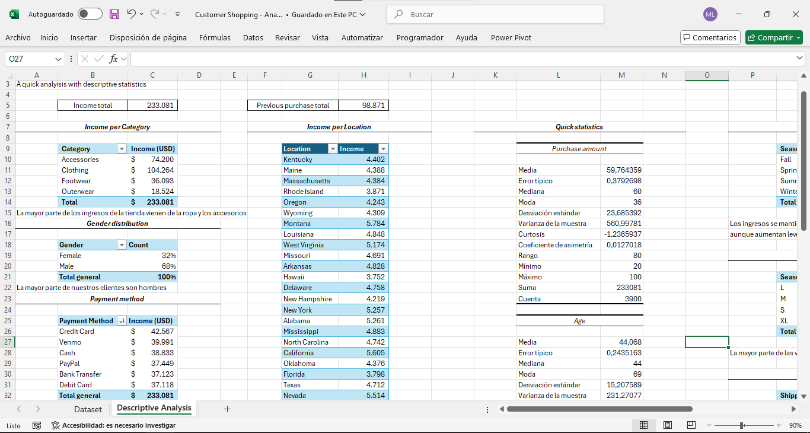
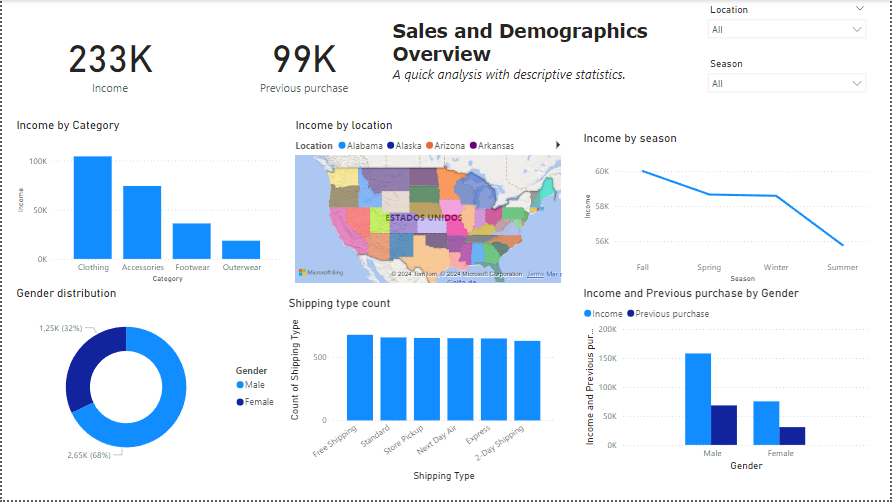
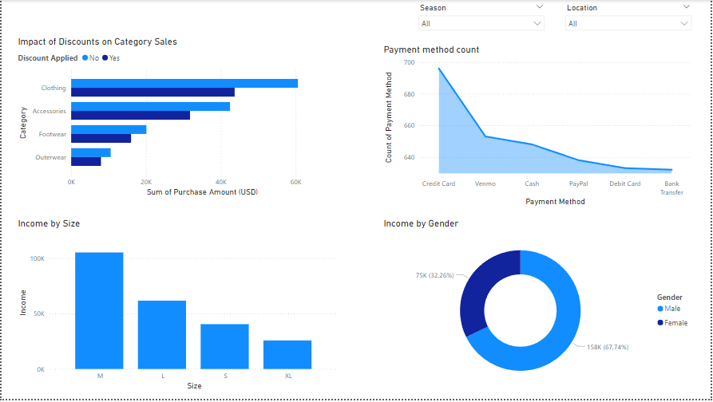

# 📊 **Data Visualization Project: Customer Shopping**

This is a data visualization project based on Kaggle's dataset named **Customer Shopping**. The data exploration and initial analysis were conducted in **Excel**, while the dashboard was developed in **Power Bi**.

Este proyecto se basa en el análisis y visualización de datos de un dataset de Kaggle llamado **Customer Shopping**. La exploración y análisis inicial se realizaron en **Excel**, mientras que las visualizaciones finales se desarrollaron en **Power BI**.

---

## 📋 **Project objetive**

The objetives of this project were to identify  purchasing patterns and key trends in customer data,highlighting important insights for decision-making. We analyzed various variables such as product categories, payment methods, gender and location.

El objetivo fue explorar patrones de compra y tendencias clave a partir de datos de clientes, identificando insights relevantes para la toma de decisiones. Se analizaron diferentes variables como categorías de productos, métodos de pago, género y ubicación.

---

## 📊 **Analysis process**

### 🔍 **Exploration and initial analysis:**
The analysis began in **Excel**, where the following task were performed:

- **Descriptive statistics**.
- **Income calculations** by:
  -Categories.
  -Payment methods.
  -Gender
  -Location

---

### 📈 **Visualization:**

The charts and dashboard were developed in **Power BI**, which allowed:

- Interpreting data more clearly.
- Faciliting the identification of key trends.
- Providing effective **visual insights* for decision-making.

---

## 🖼️ **Screenshots:**

**Excel screenshots**

**Dashboard:**

**Revenue by Category:**
   A visualization highlighting the product categories with the highest revenue. It shows that **Clothing** is the dominant category.

**Gender Distribution:**

   Displays the percentage of male and female customers. It shows that the majority of buyers are male (**68%**).

**Revenue by Season:**

   This chart compares revenue across different seasons, revealing that **Fall** and **Spring** are the most profitable.

**Most Popular Shipping Methods:**

   A chart showing the popularity of various shipping methods. **Free Shipping** leads slightly.

---

## 🚀 **Conclusion:**
This project demonstrates how initial analysis in Excel can be complemented with interactive visualizations in Power BI to provide a more comprehensive and visually appealing perspective on customer behavior..

---

## 💻 Technologies Used:**

- **Excel**: Exploratory analysis and initial calculations.
- **Power BI**: Dashboard creation and data visualization.
